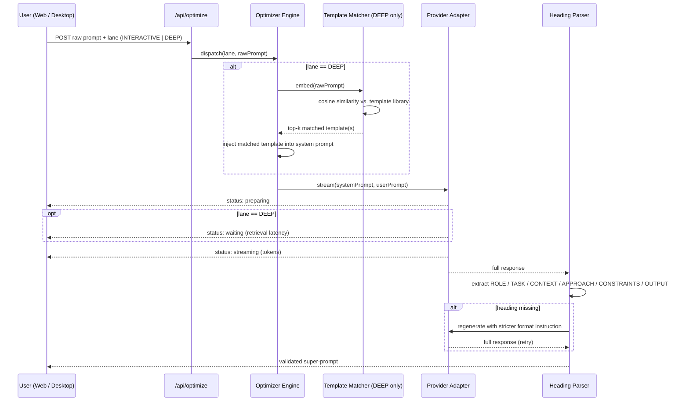
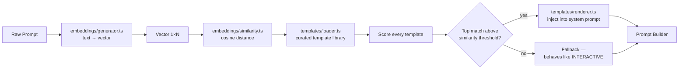
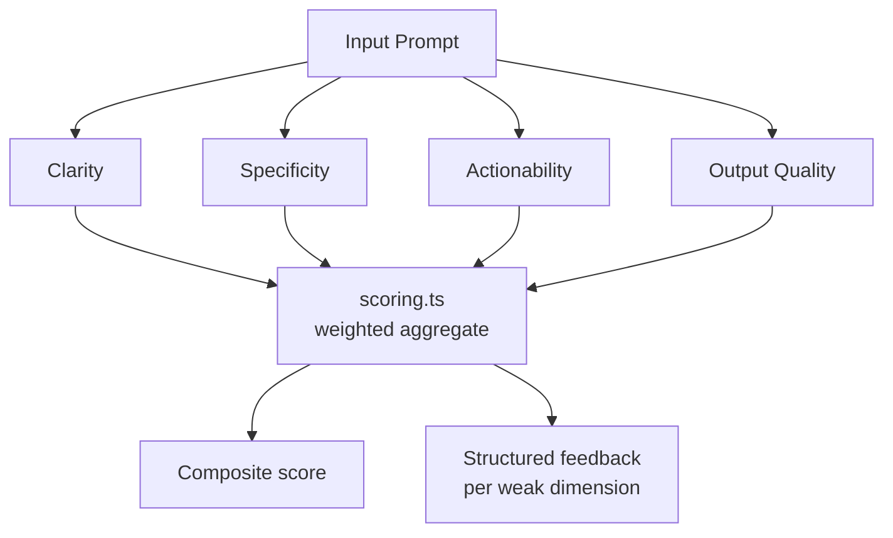
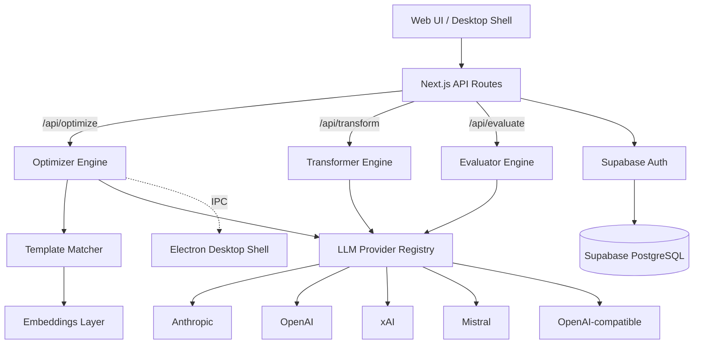

<!--
  Myprompt — Repository README
  Multi-LLM Prompt Transformation Platform
  Built by Dr. Ferdi Iskandar · Sentra Artificial Intelligence
-->

<table width="100%">
<tr>
<td width="28%" align="center" style="vertical-align:middle;">

<br />
<sub><b>Myprompt</b> · Multi-LLM Prompt Transformation Platform</sub>
</td>
<td width="72%" style="vertical-align:middle;">

# Myprompt — *Simplicity*
### Multi-LLM Optimization · Desktop Shell · Real-Time Streaming

<b>Built by Dr. Ferdi Iskandar · Sentra Artificial Intelligence</b><br />
Prompt Engineering · LLM Infrastructure · Kediri, Indonesia · UTC+7


</td>
</tr>
</table>

---

### What's inside this README

This isn't a usage guide — it's a mechanism guide. Past the front page, every section traces what actually happens to a prompt between the moment a user hits "optimize" and the moment a validated six-heading super-prompt comes back. If you're contributing to `lib/optimizer/`, `lib/templates/`, or `lib/evaluator/`, start at **Why Six Headings**, then **Core Mechanics**.

`Front Page` · `Why Six Headings` · `Core Mechanics` · `Full Feature Map + Engine Internals` · `Provider Matrix` · `System Architecture` · `Setup` · `Project Structure` · `Commands` · `Tech Stack` · `Security` · `Operating Standard`

---

## ── FRONT PAGE · WHAT THIS IS

Myprompt is a multi-LLM prompt transformation platform. It takes raw, unstructured ideas and turns them into precision-crafted, structured super-prompts — optimized for clarity, specificity, and LLM performance across any provider.

It runs as a web application (port 3013) and as a native desktop shell built on Electron, with real-time streaming output, two optimizer speed lanes, and full provider flexibility.

<table>
<tr>
<td width="33%" valign="top">

### THE PROBLEM

Raw prompts are vague. Vague prompts produce mediocre LLM output. Most engineers and clinicians write prompts the same way they write messages — without structure, without role clarity, and without thinking about how a model actually parses intent.

</td>
<td width="33%" valign="top">

### THE APPROACH

Every raw input passes through a transformation engine that restructures it into a six-heading super-prompt: **ROLE · TASK · CONTEXT · APPROACH · CONSTRAINTS · OUTPUT FORMAT**. This structure is model-agnostic, provider-agnostic, and reproducible.

</td>
<td width="33%" valign="top">

### THE OUTPUT

A production-ready prompt with clear persona assignment, explicit task scoping, contextual grounding, methodological approach, hard constraints, and output format specification — ready to paste into any LLM interface.

</td>
</tr>
</table>

---

## ── WHY SIX HEADINGS · THE PROMPT-ENGINEERING CASE

The six-heading format isn't arbitrary — each heading does one specific job in steering a model's behavior. Drop any one of them and a predictable failure mode shows up.

<table>
<tr>
<th align="left">Heading</th>
<th align="left">What it controls</th>
<th align="left">What breaks if it's missing</th>
</tr>
<tr>
<td><b>ROLE</b></td>
<td>Persona-conditioning — primes the model's vocabulary, depth, and assumptions ("senior backend engineer" vs. no role at all)</td>
<td>Generic, average-of-the-internet answers with no domain register</td>
</tr>
<tr>
<td><b>TASK</b></td>
<td>An explicit, scoped instruction — one verb, one deliverable</td>
<td>The model guesses intent and answers the wrong question</td>
</tr>
<tr>
<td><b>CONTEXT</b></td>
<td>Domain facts and background the model can't infer on its own</td>
<td>Hallucinated assumptions filling the gap you left open</td>
</tr>
<tr>
<td><b>APPROACH</b></td>
<td>Reasoning method — step-by-step, TDD-first, compare-then-decide</td>
<td>The model picks its own (often shallower) reasoning path</td>
</tr>
<tr>
<td><b>CONSTRAINTS</b></td>
<td>Explicit boundaries — what to avoid, hard limits, edge cases to skip</td>
<td>Scope creep; the model "helpfully" does more than asked</td>
</tr>
<tr>
<td><b>OUTPUT FORMAT</b></td>
<td>Structure, length, tone, rendering target</td>
<td>Unparseable prose where a structured response was needed</td>
</tr>
</table>

**Before / after, condensed:**

```text
RAW INPUT
"write me something about onboarding new employees"

SUPER-PROMPT OUTPUT
ROLE            HR operations specialist with SaaS onboarding experience
TASK            Draft a 5-day new-employee onboarding checklist
CONTEXT         Remote-first team, 10-person engineering org
APPROACH        Sequence by day, front-load access/tooling setup
CONSTRAINTS     No legal/compliance language — that's a separate doc
OUTPUT FORMAT   Markdown checklist, under 400 words
```

The last heading — OUTPUT FORMAT — is also why Myprompt's own parser can extract structured data from streamed LLM output programmatically. The format isn't just a writing convention; it's a contract the rest of the pipeline depends on.

---

## ── CORE MECHANICS · HOW THE OPTIMIZER WORKS

The optimizer is the central engine. It does not just reword your input — it structurally transforms it.

### Step-by-Step Flow

```text
USER INPUT
    │
    ▼
LANE SELECTION
    │   INTERACTIVE — fast, low-latency, ideal for everyday prompts
    │   DEEP        — richer, template-matched, ideal for complex or technical prompts
    ▼
PROMPT BUILDER
    │   Assembles a system prompt + formatted user prompt
    │   DEEP: also runs embedding-based template retrieval
    │   Template matcher finds the closest semantic match from a curated library
    ▼
LLM STREAMING
    │   Sends assembled prompt to selected provider
    │   Stream opened — tokens arrive in real time
    │   Status events emitted: preparing → waiting → streaming
    ▼
PARSER
    │   Extracts the six super-prompt headings from streamed output
    │   Validates structure — regenerates if headings are missing
    ▼
SUPER-PROMPT OUTPUT
        ROLE            ← Who the LLM should be
        TASK            ← What it must do (precise, scoped)
        CONTEXT         ← Background, domain, constraints
        APPROACH        ← Methodology, reasoning style
        CONSTRAINTS     ← What to avoid, limits, format rules
        OUTPUT FORMAT   ← Structure, length, tone, rendering
```

### Request Lifecycle — Sequence Diagram



### DEEP Lane — Template Retrieval Internals



The fallback path matters as much as the match path: if nothing in the library clears the similarity threshold, DEEP doesn't force a bad match — it silently degrades to INTERACTIVE-equivalent behavior rather than injecting irrelevant template context.

### Heading Parser — Validation & Retry

`lib/optimizer/super-prompt-format.ts` extracts the six headings from streamed output using structured parsing, not a single greedy regex — each heading has to appear with its own boundary before the next one starts. If a heading is missing or empty, the engine fires one regeneration pass with a stricter format instruction appended to the system prompt. If the retry still comes back incomplete, the raw output is returned to the user with a structure-validation warning rather than failing silently. *(Retry count and threshold are tunable — check `super-prompt-format.ts` for the current limit before documenting it as a hard guarantee elsewhere.)*

### INTERACTIVE vs DEEP

<table>
<tr>
<th align="left">Dimension</th>
<th align="left">INTERACTIVE</th>
<th align="left">DEEP</th>
</tr>
<tr>
<td><b>Speed</b></td>
<td>Fast — direct prompt build, no retrieval</td>
<td>Slower — adds embedding + template matching</td>
</tr>
<tr>
<td><b>Template retrieval</b></td>
<td>None</td>
<td>Semantic cosine similarity against prompt library</td>
</tr>
<tr>
<td><b>Best for</b></td>
<td>Everyday prompts, quick iterations</td>
<td>Complex, technical, or high-stakes prompts</td>
</tr>
<tr>
<td><b>Status events</b></td>
<td>preparing → streaming</td>
<td>preparing → waiting → streaming</td>
</tr>
<tr>
<td><b>Output depth</b></td>
<td>Standard structured super-prompt</td>
<td>Richer super-prompt with retrieval-informed context</td>
</tr>
<tr>
<td><b>Extra token overhead</b></td>
<td>None — system prompt only</td>
<td>Template context adds to system prompt length</td>
</tr>
<tr>
<td><b>Failure mode</b></td>
<td>Heading parse failure → one retry</td>
<td>Heading parse failure → one retry; no-match → silent INTERACTIVE fallback</td>
</tr>
</table>

---

## ── FULL FEATURE MAP · WHAT IT SHIPS

<table>
<tr>
<td width="50%" valign="top">

### 01 · OPTIMIZER
**Raw Idea → Structured Super-Prompt**

Takes any raw input — a sentence, a fragment, a rough idea — and produces a six-heading super-prompt. Two lanes: INTERACTIVE for speed, DEEP for depth. Real-time streaming with live status display.

**Format enforced:** ROLE · TASK · CONTEXT · APPROACH · CONSTRAINTS · OUTPUT FORMAT

</td>
<td width="50%" valign="top">

### 02 · TRANSFORMER
**Prompt Rewriting Engine**

Rewrites existing prompts across tone, persona, and intent dimensions. Switch between casual, professional, creative, and technical modes. Preserves the core meaning while restructuring delivery for a specific LLM audience.

**Use case:** adapting a prompt written for GPT-4 to work better with Claude, or shifting from technical to plain language.

</td>
</tr>
<tr>
<td width="50%" valign="top">

### 03 · EVALUATOR
**Prompt Quality Scoring**

Scores any prompt across four dimensions: clarity, specificity, actionability, and output quality. Surfaces weak spots with structured feedback. Does not rewrite — it diagnoses.

**Dimensions:** Clarity · Specificity · Actionability · Output Quality

</td>
<td width="50%" valign="top">

### 04 · DESKTOP SHELL
**Native Electron Terminal Interface**

A console-style desktop application for running Optimizer and Transformer locally. No browser required. Full real-time streaming. Keyboard-driven, dark-themed, purpose-built for prompt engineering sessions.

**Platform:** Windows, macOS, Linux · IPC bridge for main–renderer communication

</td>
</tr>
<tr>
<td colspan="2" valign="top">

### 05 · BAHASA NATIVE
**Native Indonesian Prompt Engineering**

Processes raw input directly in Bahasa Indonesia — no forced translation pass before optimization. The six-heading format maps natively, so the structural rigor doesn't get lost going from English to Indonesian:

`PERAN (Role) · TUGAS (Task) · KONTEKS (Context) · PENDEKATAN (Approach) · BATASAN (Constraints) · FORMAT KELUARAN (Output Format)`

<p align="center">

</p>

**Use case:** tim klinis, akademik, atau korporat di Indonesia yang menulis instruksi langsung dalam Bahasa Indonesia tanpa harus melalui terjemahan ke Inggris dulu.

</td>
</tr>
</table>

### Engine Internals — Mechanism Notes

These are implementation-level notes for contributors working inside `lib/`. Where exact constants live in code rather than docs, that's flagged explicitly instead of guessed at.

**Optimizer — strategy pattern.** `lib/optimizer/strategies.ts` implements INTERACTIVE and DEEP as two concrete strategies behind a shared interface (`buildPrompt()`, `shouldRetrieveTemplate()`). `engine.ts` only knows which strategy to dispatch to — it doesn't branch on lane logic itself. Adding a third lane means writing a new strategy, not touching the dispatcher.

**Transformer — mode matrix.** Each mode shifts the same four levers: tone marker, sentence length, vocabulary register, and structural change. This is the documented intent for `lib/transform/engine.ts` — confirm against the live implementation before treating exact wording as final.

<table>
<tr>
<th align="left">Mode</th>
<th align="left">Tone marker</th>
<th align="left">Vocabulary register</th>
<th align="left">Structural change</th>
</tr>
<tr>
<td><b>Casual</b></td>
<td>Contractions, direct address</td>
<td>Everyday words, minimal jargon</td>
<td>Shorter sentences, fewer subordinate clauses</td>
</tr>
<tr>
<td><b>Professional</b></td>
<td>Neutral, declarative</td>
<td>Domain-standard terminology</td>
<td>Balanced sentence length, clear topic sentences</td>
</tr>
<tr>
<td><b>Creative</b></td>
<td>Varied rhythm, figurative language allowed</td>
<td>Broader, more associative vocabulary</td>
<td>Looser structure, room for narrative framing</td>
</tr>
<tr>
<td><b>Technical</b></td>
<td>Precise, unambiguous</td>
<td>Field-specific terms, defined on first use</td>
<td>Numbered steps, explicit preconditions</td>
</tr>
</table>

**Evaluator — scoring methodology.** Each dimension in `lib/evaluator/dimensions.ts` runs an independent heuristic check, then `lib/evaluator/scoring.ts` combines all four into one composite score.



What each dimension actually checks:
- **Clarity** — flags ambiguous pronouns, undefined jargon, multiple unrelated asks bundled into one prompt.
- **Specificity** — rewards concrete nouns, numbers, and named entities; penalizes filler like "something" or "good."
- **Actionability** — checks for an explicit deliverable verb (write, compare, calculate) vs. an open-ended statement with no clear output.
- **Output Quality** — a forward-looking proxy: how well-formed the eventual LLM response is likely to be, given the prompt's structure.

*Weighting between dimensions is configured in `scoring.ts` — document the exact weights there once they're finalized rather than restating a number here that could drift out of sync with the code.*

**Desktop shell — IPC contract.** Every renderer-to-main call goes through a typed handler in `desktop/ipc/`, validated at the boundary (see Security, below) before it reaches Electron's main process. The renderer never gets direct Node access — `nodeIntegration` stays off.

---

## ── PROVIDER MATRIX · LLM SUPPORT

<table>
<tr>
<th align="left">Provider</th>
<th align="left">Models Available</th>
<th align="left">Mode</th>
</tr>
<tr>
<td><b>Anthropic</b></td>
<td>Claude Opus 4, Sonnet 4.6, Haiku 4.5</td>
<td>API key (BYOK)</td>
</tr>
<tr>
<td><b>OpenAI</b></td>
<td>GPT-4o, GPT-4o mini, GPT-4 Turbo</td>
<td>API key (BYOK)</td>
</tr>
<tr>
<td><b>xAI</b></td>
<td>Grok-2, Grok-2 Vision</td>
<td>API key (BYOK)</td>
</tr>
<tr>
<td><b>Mistral</b></td>
<td>Mistral Large, Mistral Nemo</td>
<td>API key (BYOK)</td>
</tr>
<tr>
<td><b>OpenAI-compatible</b></td>
<td>Any model via custom base URL</td>
<td>OpenRouter, Pioneer, local endpoint</td>
</tr>
</table>

BYOK = Bring Your Own Key. No keys are stored server-side. All provider credentials are encrypted client-side and never logged.

Every provider in `lib/llm/providers/` implements the same adapter contract — a single `streamCompletion()` interface that the engine layer calls without knowing which provider is underneath. Adding a new provider means writing one adapter file, not touching the optimizer, transformer, or evaluator.

---

## ── SYSTEM ARCHITECTURE

```text
WEB UI / DESKTOP SHELL
    │
    ▼
API ROUTES (Next.js App Router)
    │   /api/optimize   → Optimizer engine (INTERACTIVE / DEEP)
    │   /api/transform  → Transformer engine
    │   /api/evaluate   → Evaluator engine
    │   /api/auth/*     → Supabase Auth handlers
    ▼
ENGINE LAYER (lib/)
    │
    ├── optimizer/
    │       engine.ts       ← lane dispatch, prompt build, stream control
    │       strategies.ts   ← INTERACTIVE vs DEEP strategy implementations
    │       super-prompt-format.ts ← heading parser and formatter
    │
    ├── transform/
    │       engine.ts       ← transformation logic
    │       schemas.ts      ← Zod contracts for transform requests
    │
    ├── evaluator/
    │       engine.ts       ← scoring orchestration
    │       dimensions.ts   ← per-dimension scoring logic
    │       scoring.ts      ← aggregate score computation
    │
    ├── llm/
    │       provider-registry.ts   ← runtime provider selection
    │       providers/             ← per-provider adapters (streaming)
    │       prompt-builder.ts      ← system + user prompt assembly
    │
    ├── templates/
    │       loader.ts       ← reads curated template library
    │       matcher.ts      ← cosine similarity matching
    │       renderer.ts     ← injects template into DEEP prompt
    │
    └── embeddings/
            generator.ts    ← text → embedding vector
            similarity.ts   ← cosine distance computation
    ▼
SUPABASE (PostgreSQL)
    │   Auth, user data, API key vault (encrypted), usage records
    ▼
ELECTRON (Desktop)
    │   main.ts      ← Electron main process, window manager
    │   preload.ts   ← context bridge (no nodeIntegration)
    │   ipc/         ← IPC handlers for each engine action
    │   renderer/    ← Terminal-style UI, streaming display
```

### Visual Flow

The tree above is the file map. This is the same system as a request-routing diagram — useful when you're tracing where a call goes rather than where a file lives.



---

## ── SETUP · STEP BY STEP

**Requirements**

- Node.js ≥ 22
- pnpm 9.x
- Supabase project (free tier works)
- At least one LLM provider API key

**Step 1 — Clone and install**

```bash
git clone https://github.com/drferdii/Myprompt.git
cd Myprompt
pnpm install
```

**Step 2 — Configure environment**

```bash
cp .env.example .env
```

Open `.env` and fill in:

| Variable | Description | Required |
|----------|-------------|----------|
| `DATABASE_URL` | Supabase PostgreSQL connection string | ✅ |
| `NEXT_PUBLIC_SUPABASE_URL` | Supabase project URL | ✅ |
| `NEXT_PUBLIC_SUPABASE_ANON_KEY` | Supabase anon key | ✅ |
| `SUPABASE_SERVICE_ROLE_KEY` | Service role key (server-side only) | ✅ |
| `ANTHROPIC_API_KEY` | Anthropic (Claude) | optional |
| `OPENAI_API_KEY` | OpenAI | optional |
| `XAI_API_KEY` | xAI Grok | optional |
| `MISTRAL_API_KEY` | Mistral | optional |
| `OPENAI_BASE_URL` | Custom OpenAI-compatible endpoint | optional |

**Step 3 — Initialize database**

```bash
pnpm db:generate     # generate Prisma client from schema
pnpm db:migrate      # apply migrations to Supabase
```

**Step 4 — Start the web app**

```bash
pnpm dev             # starts at http://localhost:3013
```

**Step 5 — (Optional) Run the desktop shell**

```bash
pnpm desktop:build   # compile Electron renderer + main process
pnpm desktop:start   # launch the desktop app
```

---

## ── PROJECT STRUCTURE

```text
Myprompt/
│
├── app/                        Next.js App Router
│   ├── api/                    API routes (optimize, transform, evaluate, auth)
│   └── (pages)/                Web UI pages
│
├── components/                 Shared UI components
│
├── lib/                        Core engine layer
│   ├── optimizer/              Prompt optimization engine
│   ├── transformer/            Prompt rewriting engine
│   ├── evaluator/              Prompt scoring engine
│   ├── llm/                    LLM provider adapters + registry
│   ├── templates/              Template library loader + matcher
│   ├── embeddings/             Vector generation + similarity
│   ├── auth/                   Auth guards and rate limiting
│   ├── billing/                Plan enforcement and subscription
│   ├── db/                     Prisma client singleton
│   ├── supabase/               Supabase client variants (server, browser, admin)
│   └── prompt-quality/         Quality scoring contracts
│
├── desktop/                    Electron desktop shell
│   ├── main.ts                 Electron main process
│   ├── preload.ts              Context bridge
│   ├── ipc/                    IPC handlers per feature
│   └── renderer/                Terminal-style console UI
│
├── prisma/                     Database schema + migrations
│   ├── schema.prisma
│   └── migrations/
│
├── __tests__/                  Vitest test suites
├── scripts/                    Acceptance harness and utilities
├── public/                     Static assets
├── types/                      Global TypeScript types
│
├── .agent/                     Agent governance SSOT
│   ├── CONTEXT.md
│   ├── PROGRESS.md
│   ├── HANDOFF.md
│   ├── LESSONS.md
│   └── DECISIONS.md
│
├── AGENTS.md                   Agent workflow and task protocol
├── CLAUDE.md                   Claude Code project instructions
├── .env.example                Environment variable template
└── package.json
```

---

## ── COMMANDS REFERENCE

```bash
# Development
pnpm dev                    # web app on http://localhost:3013
pnpm build                  # production build

# Testing
pnpm test                   # run all Vitest tests
pnpm test:desktop           # desktop-specific tests

# Desktop
pnpm desktop:build          # compile Electron shell
pnpm desktop:start          # launch desktop app

# Database
pnpm db:generate            # generate Prisma client
pnpm db:migrate             # apply migrations
pnpm db:studio              # open Prisma Studio

# Quality
pnpm lint                   # ESLint
pnpm typecheck              # TypeScript strict check

# Optimizer acceptance harness
pnpm optimizer:acceptance   # live end-to-end test with real provider
```

---

## ── TECH STACK


---

## ── SECURITY

<table>
<tr>
<td width="50%" valign="top">

### API KEY SAFETY

All provider API keys are stored encrypted. They are never logged, never included in Sentry payloads, and never transmitted outside the local session context. BYOK by design — no server-side key storage.

</td>
<td width="50%" valign="top">

### NO PHI / NO PII

This is a prompt engineering tool. It does not process patient data, clinical records, or personally identifiable information. Error tracking via Sentry is scoped to technical errors only.

</td>
</tr>
<tr>
<td width="50%" valign="top">

### ENVIRONMENT ISOLATION

`.env` files are gitignored at all levels. The `.env.example` contains only placeholder keys. Service role credentials are server-side only and never exposed to the browser.

</td>
<td width="50%" valign="top">

### ELECTRON CONTEXT BRIDGE

The desktop shell uses a strict preload context bridge. `nodeIntegration` is disabled. All IPC communication is typed and validated at the boundary before reaching the main process.

</td>
</tr>
</table>

---

## ── THE OPERATING STANDARD

```text
No prompt output without structure.
No provider switch without explicit user selection.
No API key in any log, error payload, or Sentry event.
No feature without a failing test to define it first.
No desktop action without IPC validation at the boundary.
```

<table>
<tr>
<th align="left">Question</th>
<th align="left">Required answer</th>
</tr>
<tr>
<td><b>What is the prompt trying to do?</b></td>
<td>Specific task with clear ROLE and OUTPUT FORMAT — not a vague instruction.</td>
</tr>
<tr>
<td><b>Which lane is appropriate?</b></td>
<td>INTERACTIVE for speed; DEEP for complex or high-stakes prompts.</td>
</tr>
<tr>
<td><b>Which provider is handling it?</b></td>
<td>Explicit user selection — no silent fallback to a default model.</td>
</tr>
<tr>
<td><b>What can go wrong?</b></td>
<td>Stream timeout, heading parse failure, provider rate limit — all handled explicitly.</td>
</tr>
<tr>
<td><b>How is it verified?</b></td>
<td>Acceptance harness runs against real provider endpoints. No fabricated test output.</td>
</tr>
</table>

---

## ── LETS CONNECT

[](https://linkedin.com/in/dr-ferdi-iskandar-1b620a3b5)
[](https://x.com/ClaudesyI81047)
[](https://discord.gg/1511829076313374745)
[](https://medium.com/@codieverse)
[](https://tiktok.com/@drferdii)
[](mailto:drferdiiskandar@gmail.com)

---

<p align="center">
  <b>Myprompt · Simplicity — built to make every prompt count.</b><br />
  <sub>Sentra Artificial Intelligence · Dr. Ferdi Iskandar · Indonesia</sub>
</p>
